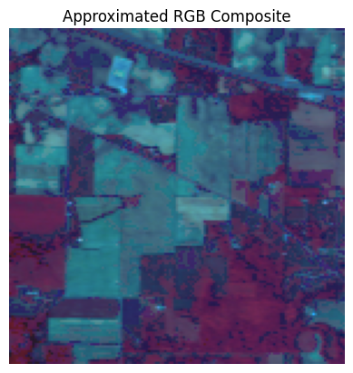
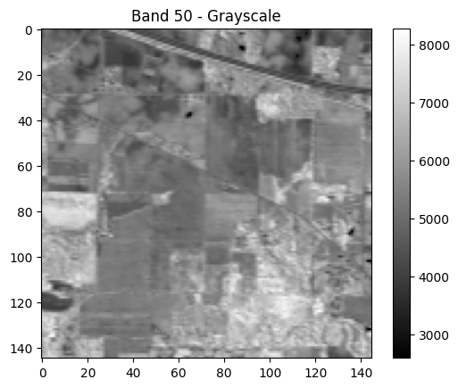
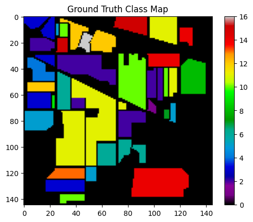

# Hyperspectral Imaging - Foundational Research

## Overview

This repository marks the beginning of my research journey into Hyperspectral Imaging (HSI), a technique that captures a wide range of spectral information beyond the visible spectrum. HSI has emerging applications in various domains including agriculture, defense, remote sensing, environmental monitoring, and medical diagnostics.

## Objective

The project aims to:
- Understand the fundamentals of hyperspectral image formation and structure
- Explore preprocessing techniques including normalization and dimensionality reduction
- Visualize and analyze spectral signatures across different land cover types
- Build a basic classification pipeline to distinguish between classes in benchmark datasets
- Lay the foundation for future spectral-spatial deep learning models

## Current Progress

- Conducted detailed analysis of publicly available HSI datasets (e.g., Indian Pines)
- Implemented basic data cube exploration (visualizing individual bands and RGB composites)
- Generated and analyzed spectral signature plots of selected regions
- Applied PCA for band reduction while retaining maximum variance
- Built a patch-based classification framework using a 3D Convolutional Neural Network (3D-CNN)
- Evaluated performance on a subset of the data with decent initial results

For full implementation details and visualizations, refer to the [HSI.ipynb](HSI.ipynb) notebook.

## Model

A 3D Convolutional Neural Network was implemented to learn both spectral and spatial features jointly from input HSI patches. The architecture was kept minimal to test viability on reduced-size input, while maintaining interpretability.

Key model components:
- 3D convolutional layers followed by ReLU activations and max pooling
- Fully connected layers for final classification
- Trained using Adam optimizer and cross-entropy loss

## Example Results

Visualizations generated during this study include:

Images are available in the `img/` directory and are referenced from the notebook.
